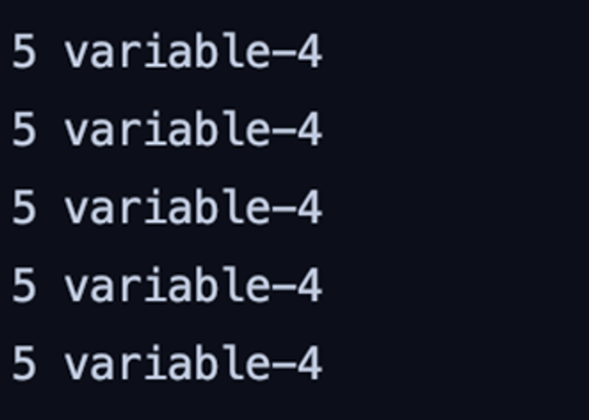
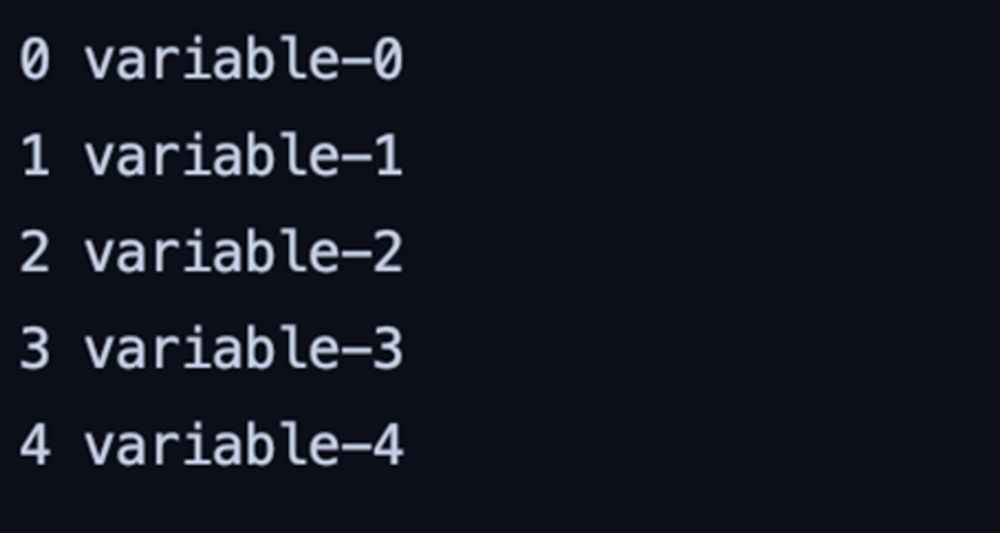

# 슈퍼코딩 네이버 클라우드_5주차 DAY 4 과제

### 😎 네이버클라우드_DAY4_팀장님 지시 업무_문제

해당 코드는 버그가 있는 코드로, 실행하면 아래의 `<에러 코드 화면>` 과 같이 결과가 나온다. <br />
이 코드를 최소한으로 수정하여, 하단의 `<정상 코드 화면>` 같이 결과가 나오게 바꾸어보자.

```javascript
for (var i = 0; i < 5; i++) {
  var variable = 'variable-' + i;
  setTimeout(function () {
    console.log(i + ' ' + variable);
  }, 100)
}
```

|<에러 코드 화면> |<정상 코드 화면>|
|:---:|:---:|
|  |  |

<br>
<br>

#### 🤔 왜 위와 같은 에러코드 처럼 출력되는 걸까?
* *setTimeout이 어떻게 동작되는 녀석인지 파악해야 한다!*

  : `setTimeout( )`은 일정 시간이 경과한 후에 콜백함수를 호출시킨다. <br />
  이때, 비동기 처리 방식으로 진행된다.
  > ### 비동기 처리방식이란?
  > : 현재 실행중인 태스크가 종료되지 않은 상태라도 다음번째에 있는 태스크를 블로킹(작업 중단)하지 않고 바로 실행될 수 있도록 하는 방식

  <br />

  위의 문제 코드에서 for문이 실행될 때, `i`의 값은 맨 처음 0 부터 시작하는데,
  setTimeout( )으로 인해 100ms가 경과될 때까지 콜백함수가 호출되는 것을 기다리는 동안 <br />
  for문은 i 값이 5가 되어 종료되기 전까지 계속 순회하면서 값이 1씩 증가하게 된다.
  
  그리고 100ms가 경과되어 콜백함수가 실행될 때, for문에서 마지막에 실행된 i값(= 4)이 setTimeout의 콜백함수에 들어가 있는 상태이기 때문에 위의 에러코드 화면처럼 실행되는 것이다!

  <br />
  
  for문에서 i값을 setTimeout 앞, 뒤에서 어떻게 동작하는지 console.log로 찍어보면 보다 더 명확하게 알 수 있다.

  ```javascript
  for (var i = 0; i < 5; i++) {
    var variable = 'variable-' + i;
    console.log(`setTimeout 앞에 있는 ${i} 값`);

    setTimeout(function () {
      console.log(i + ' ' + variable);
    }, 100)

    console.log(`setTimeout 뒤에 있는 ${i} 값`);
  }
  ```
  ```javascript
  setTimeout 앞에 있는 0 값
  setTimeout 뒤에 있는 0 값
  setTimeout 앞에 있는 1 값
  setTimeout 뒤에 있는 1 값
  setTimeout 앞에 있는 2 값
  setTimeout 뒤에 있는 2 값
  setTimeout 앞에 있는 3 값
  setTimeout 뒤에 있는 3 값
  setTimeout 앞에 있는 4 값
  setTimeout 뒤에 있는 4 값
  5 variable-4
  5 variable-4
  5 variable-4
  5 variable-4
  5 variable-4
  ```
  
  <br />

  처음에 "console.log(`setTimeout 앞에 있는 ${i} 값`)"를 통해서 setTimeout( )을 만나기 전까지는 i값이 순차적으로 증가하고 있음을 보여주고 있다. <br />

  또한 아직 100ms가 경과되지 않아서 setTimeout 안에 있는 콜백함수가 호출되지 못하고 기다리는 동안, 뒤에 있는 "console.log(`setTimeout 뒤에 있는 ${i} 값`)" 이 바로 이어서 동작하는 것을 볼 수 있다.

  그렇게 동작하다가 100ms가 지나고 setTimeout 안에 있던 콜백함수가 호출되어 출력될 때, 마지막에 쌓여있던 i값이 한꺼번에 몰아서 출력되는 것을 볼 수 있다.


<br />
<br />

#### ❗❓ 어떻게 해결해야 할까?
그럼 setTimeout의 비동기처리 방식 때문에 아직 태스크가 실행종료되지 않은 상태에서 for문을 바로 실행되도록 하고 있기 때문에 for문과 setTimeout의 순서를 바꿔 100ms초가 모두 경과되고 for문이 실행될 수 있도록 만들면 되지 않을까라고 생각된다.


<br />
<br />

#### [🙋‍♀️ 최종 : 내가 생각한 코드](./W5D4.js)

```javascript
setTimeout(function () {
  for (var i = 0; i < 5; i++) {
    var variable = 'variable-' + i;
    console.log(i + ' ' + variable);
  }
}, 100)
```