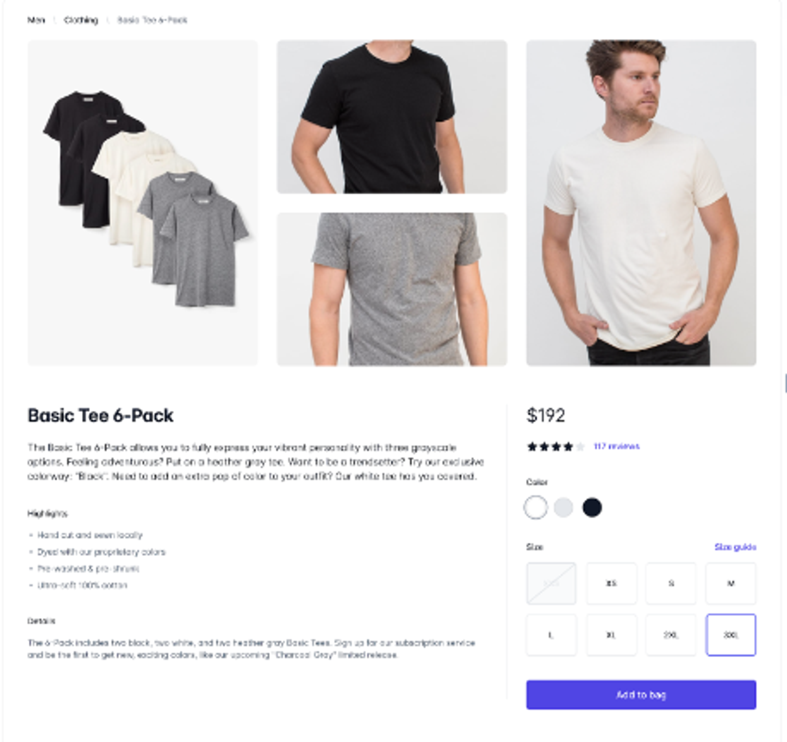
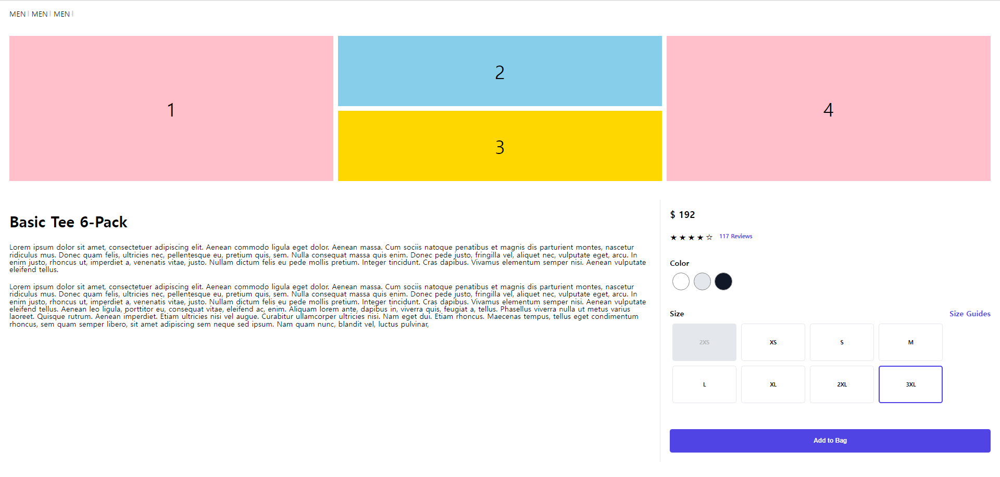

# 슈퍼코딩 네이버 클라우드_7주차 DAY 1 과제

### 😎 스노우_DAY1_팀장님 지시 업무_문제
: 해당 상품 상세 페이지를 styled-components와 tailwindcss 를 가지고 각각 구현해보기.

 
 

#### [🙋‍♀️ 최종 : 내가 작성한 코드](./css-in-js/src/App.js)

- style-component로 작성한 화면
